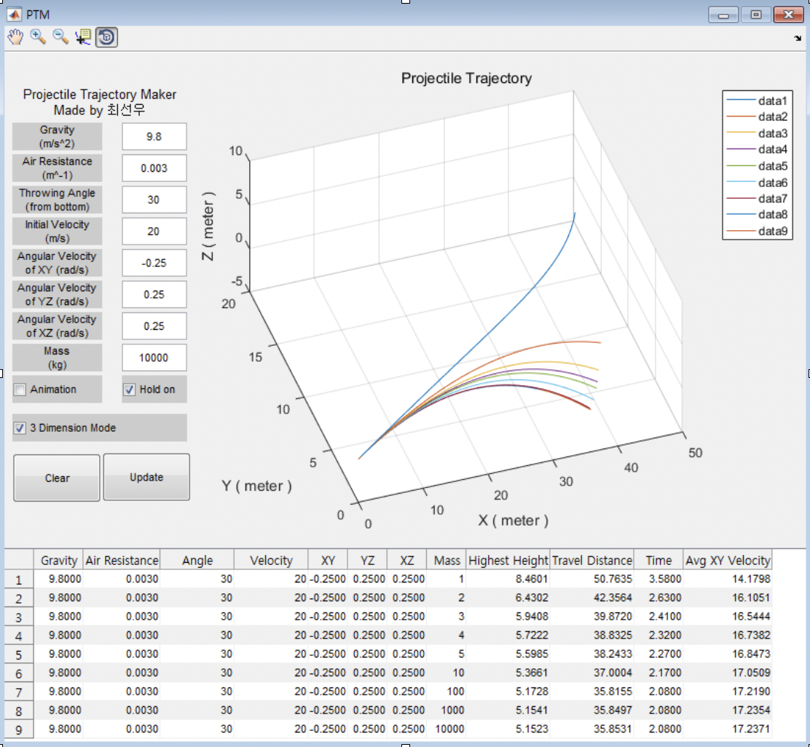

# Projectile Trajectory Maker

## Description

This program generates a two-dimension, or three-dimension trajectory of a projectile based on the throwing angle, air resistance, magnus effect generated by the spin, mass, gravity, and the initial velocity. This program can generate an animation and record the time consumed to hit the ground, the highest height, distance traveled, average speed on the XY plane.

## Getting Started

### Dependencies

* MATLAB required

### Installing

* Must download the zip or clone the repo

### Executing program

* The program is not available standalone as exe
* Open PTM.m in MATLAB and run in MATLAB

## Help

* To log the data, check the log button to save data

## Authors

* SunWu Choi

## Version History

* 0.1
    * Initial Release

## License

* No License

## Acknowledgments

Inspiration, code snippets, etc.
* [MATLAB GUI document](https://www.mathworks.com/discovery/matlab-gui.html)
